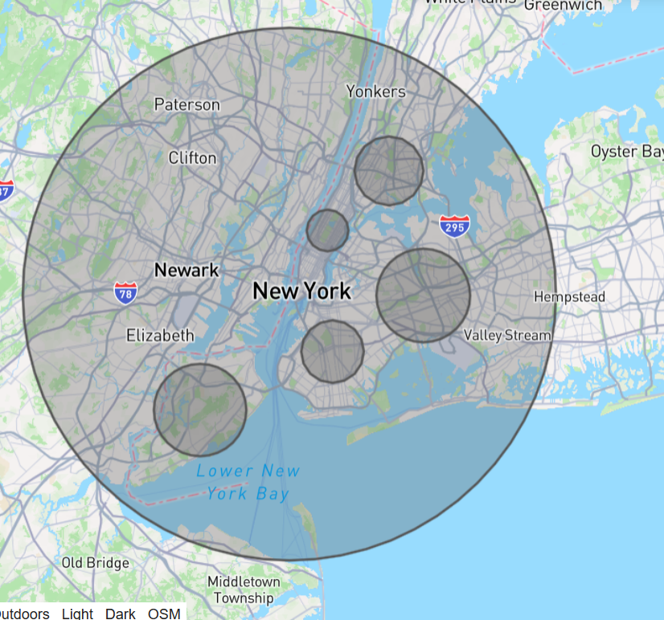
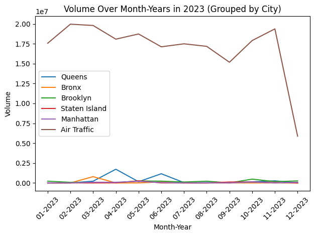
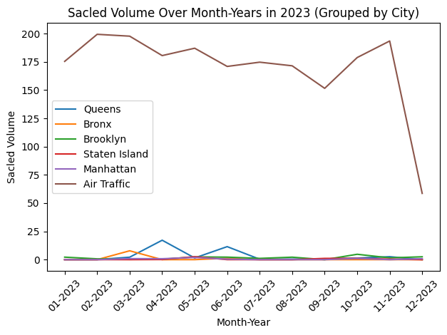
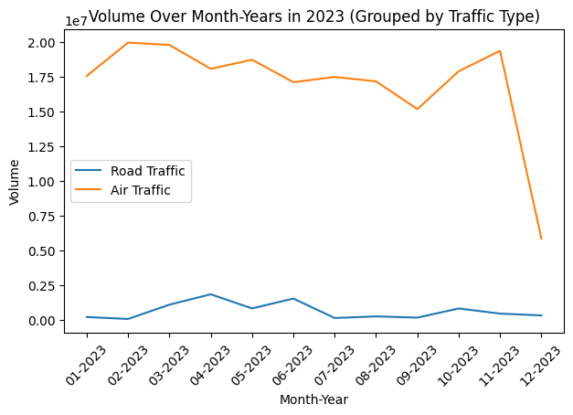
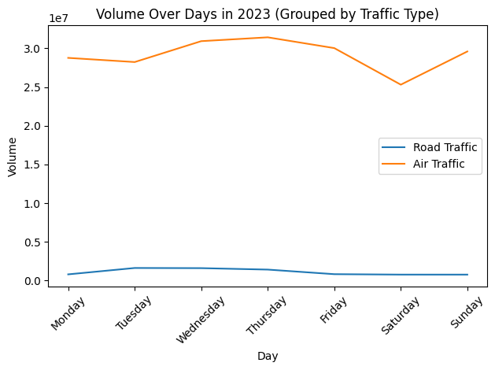
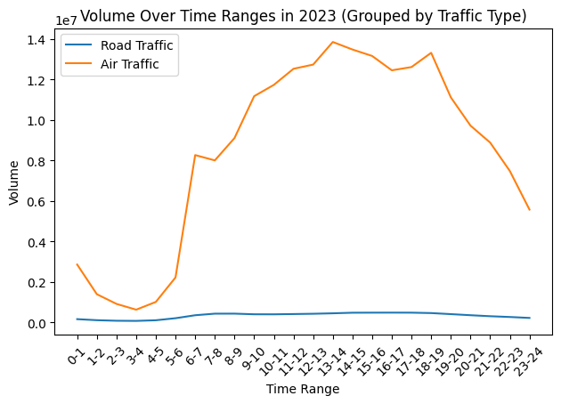

# **NYC Road Traffic vs Air traffic**
##### Sai Surya Teja Padakanti
### **Objective:**
This report looks at road and air traffic in New York City, aiming to find connections between them. New York City is busy with lots of roads and a bustling aviation industry. We'll study things like how busy the roads and skies are and when they're busiest. By comparing them, we hope to understand better how they affect each other. This could help make decisions about how to improve transportation in the city for everyone. The map below displays the areas of New York City where we collected data. The large circle represents air traffic, while the smaller circles indicate the city areas included for road traffic analysis.(Note: The map is only for the basic understanding of what areas of data is beign compared, this is not accurate plot of the data. )


### **Data Scource:**
**Road traffic data**

The data is collected from NYC Open data [Data Source](https://data.cityofnewyork.us/Transportation/Automated-Traffic-Volume-Counts/7ym2-wayt/data_preview). It has aournd 1.6M rows starting date time from 2000-01-01 00:15:00 to 2023-12-10 23:45:00 and coverring 5 major places of New York, 'Brooklyn', 'Bronx', 'Manhattan', 'Queens' and 'Staten Island'. Below is the basic format of how the data is Provided in CSV.

| RequestID     | Boro     |yr | M | D | HH | MM | vol | Semented ID | WktGeom | Street | fromst | toSt | Direction |
|--------------|-----------|------------|--------------|-----------|------------| --------------|-----------|------------|--------------|-----------|------------|-----------|------------|
| 34178 | Brooklyn | 2022 | 1 | 4 | 16 | 0 | 111 |189074 | POINT (993228.5264971782 150600.75237618468) | OCEAN PARKWAY | Dead End | Ocean View Avenue | NB |
| 34178 | Brooklyn | 2022 | 1 | 4 | 16 | 15 | 98 | 189074 | POINT (993228.5264971782 150600.75237618468) | OCEAN PARKWAY | Dead End | Ocean View Avenue | NB |


**Description of each column**
| Column Name | Description | Type |
|--------------|-------------|-----|
|RequestID|An unique ID that is generated for each counts request.|integer|
|Boro|Lists which of the five administrative divisions of New York City the location is within, written as a word.|string|
|Yr|The two digit year portion of the date when the count was conducted.|integer|
|M|The two digit month portion of the date when the count was conducted.|integer|
|D|The two digit day portion of the date when the count was conducted.|integer|
|HH|The two digit hour portion of the time when the count was conducted.|integer|
|MM|The two digit start minute portion of the time when the count was conducted.|integer|
|Vol|The total sum of count collected within a 15 minute increments.|integer|
|SegmentID|The ID that identifies each segment of a street in the LION street network version 14.|integer|
|WktGeom|A text markup language for representing vector geometry objects on a map and spatial reference systems of spatial objects.|string|
|street|The 'On Street' where the count took place.|string|
|fromSt|The 'From Street' where the count took place.|string|
|toSt|The 'To Street' where the count took place.|string|
|Direction|The text-based direction of traffic where the count took place.|string|

**Air traffic data**

University provided the New York ADSB data through an SFTP server. The server had more tha 520 compressed file, starting date from 2022-10-06 to 2024-03-23, one zip file for each date. Each zip file consiste of a text file with more than 1000000 observation in jason format. 1 observation is an aircarft passing through the particular area. 

```
{"type": "new_adsb", "dt": "2024-04-03 00:00:01.030013", "payload": {"hex": "0c6064", "flight": "BWA601  ", "alt_baro": 35000, "alt_geom": 35400, "gs": 485.9, "track": 140.5, "baro_rate": 0, "squawk": "0573", "emergency": "none", "category": "A3", "nav_qnh": 1013.6, "nav_altitude_mcp": 35008, "nav_heading": 158.9, "lat": 41.879091, "lon": -75.110396, "nic": 8, "rc": 186, "seen_pos": 1.0, "version": 2, "nic_baro": 1, "nac_p": 10, "nac_v": 2, "sil": 3, "sil_type": "perhour", "gva": 2, "sda": 2, "mlat": [], "tisb": [], "messages": 207, "seen": 0.0, "rssi": -26.2}}
{"type": "new_adsb", "dt": "2024-04-03 00:00:01.032740", "payload": {"hex": "a3ad6d", "flight": "EDV5411 ", "alt_baro": 24775, "alt_geom": 25100, "gs": 450.8, "track": 36.2, "geom_rate": 1856, "squawk": "3344", "emergency": "none", "category": "A3", "nav_qnh": 1012.8, "nav_altitude_mcp": 27008, "nav_heading": 40.8, "lat": 41.54187, "lon": -73.074438, "nic": 8, "rc": 186, "seen_pos": 0.2, "version": 2, "nic_baro": 1, "nac_p": 10, "nac_v": 1, "sil": 3, "sil_type": "perhour", "gva": 2, "sda": 2, "mlat": [], "tisb": [], "messages": 1270, "seen": 0.2, "rssi": -23.3}}
```
**Description of few columns which are useful for air traffic**
| Column Name | Description | Type |
|--------------|-------------|-----|
|type|Type of underlying messages or the best source of current data for this position/aircraft.|string|
|dt|Date and time at which the airacft is recorded.|string|
|hex| The aircraft identifier.|string|

### **Data Processing:**
The collected data has been processed in Python for comparison. The processed dataset includes columns for city, date, day, time range, and volume. To ensure consistency, the analysis begins on the latest start date between the two datasets and ends on the earliest end date. This approach ensures a comprehensive comparison of the merged data.
| Column Name | Description | Type |
|--------------|-------------|-----|
|City|City name at which the data is recorded, for Air traffic data this column values is taken as Air traffic.|string|
|Date|Date at which the data is recorded.|Date|
|Day| Day of week. |string|
|Time_range|24 hours time is divided in to 1 hours rages (0-1,1-2,2-3....,23-24).|string|
|Voulme| Count of the traffic. |integer|

**Road traffic data**

First, an empty dictionary is created, and the file is read using the CSV module in Python. Each line is parsed by splitting it at ','. The columns 'Yr', 'M', 'D', 'HH', 'MM' are combined into a string and converted into a datetime variable using the datetime module. The day of the week is extracted using the same module. The 'boro' column is renamed as 'city'.

Then, a time range dictionary is initialized for each date and values for each time range is set to zero. By using the 'hour' column, the corresponding time range is determined, and the volume is added to the respective time range in the dictionary. This process iterates through the entire dataset for date range, and the processed data is saved into a new CSV file.

**Air traffic data**

Using the Paramiko module in Python, one can establish a connection to the SFTP server to download the necessary files. Upon downloading, the zip files are extracted using the os module and stored in the specified local path. Each extracted file can then be processed similarly to the road traffic data, utilizing the 'dt' column in the dataset. After completing the ETL (Extract, Transform, Load) process, both the downloaded and extracted files can be deleted.

This process is repeated for each date range, and the extracted data is appended to a new CSV file. By automating this process, one can efficiently handle the large volume of files and data, saving considerable time and effort compared to manual execution. The total time taken for this process is 145min.

(Note: This extracted files is then mergerd in a way suitable for creating graphs using python)

### **Road traffic vs Air traffic:**
Using the Matplotlib.pyplot module in Python, the processed data is visualized by plotting the Volume against time ranges, date, and day, and group by city column to identify any potential patterns. 
(Note: The data is plotted only for the year 2023 to have a clear visulaization.)

The initial graph presents traffic volume plotted against the months of the year. However, there's a notable difference in data availability between road traffic and air traffic. This variance in data availability is a key factor contributing to the differences of traffic volume observed in the plotted lines.This difference made difficulty in understaing the relation.

Later, the data is scaled based on min-max normalization and plotted (as shown in Figure-2). Even in this graph, there is no notable relation between air traffic and city traffic. 

Then, the traffic volume of the cities is aggregated and treated as road traffic. The graph is grouped with road traffic and air traffic (Figure-3). However, even in this graph, there is no notable change. Additionally, for some dates and times, the data for certain cities is missing, but this did not significantly affect the plots.

Subsequently, the volume is plotted against the days of the week and time ranges (as shown in Figure-4 and Figure-5). Even in these graphs, there is not a significant relationship between air traffic and road traffic. The only notable relation found is in Figure-5, where there is a slight direct relation between air traffic and road traffic during the mid-hours of the day. However, it's challenging to draw definitive conclusions due to the availability of road traffic data.

### **Future Scope:**
The analysis reveals several data limitations for road traffic, including significant missing data and the potential for double-counting aircraft in the air traffic dataset due to repeated observations of the same aircraft. To address these challenges, several steps can be taken:

+ Improving Road Traffic Data Accuracy:
Acquire accurate and comprehensive road traffic data for all required date-times across various areas within New York City. This may involve collaborating with local authorities or transportation agencies to access reliable and up-to-date traffic information.
+ Identifying and Removing Duplicate Aircraft Observations:
Utilizing hex identifiers (hex) and time of capture to identify and track individual aircraft. By matching hex values, duplicate observations of the same aircraft for certain time range can be identified and filtered out from the dataset.

### **Appendix 1- Images**

**Figure-1**



**Figure-2**



**Figure-3**



**Figure-4**



**Figure-5**




### **Appendix 2- Code**
**Processing road traffic data**
```python
from datetime import datetime, timedelta
import csv
city_date_time_volume={}
time_ranges = [(hour, hour+1) for hour in range(0, 24)]
time_range_counts = {f"{start_hour}-{end_hour}": 0 for start_hour, end_hour in time_ranges}
start_date = datetime(2022, 10, 6).date()
end_date = datetime(2023, 12, 10).date()
#Function to parse the date time 
def parse_datetime(year, month, day, hour, minute):
    return datetime(year, month, day, hour, minute)
#accessing the data 
with open("Road_traffic.csv", "r") as file:
    next(file)  
    for line in file:
        parts = line.strip().split(",")
        city = parts[1]
        year, month, day, hour, minute = map(int, parts[2:7])
        date_time = parse_datetime(year, month, day, hour, minute)
        date_key = date_time.date()
        if start_date <= date_key <= end_date:
            if city not in city_date_time_volume:
                city_date_time_volume[city] = {}
                city_date_time_volume[city][date_key]= {f"{start_hour}-{end_hour}": 0 for start_hour, end_hour in time_ranges}
            elif date_key not in city_date_time_volume[city]:
                city_date_time_volume[city][date_key] = {f"{start_hour}-{end_hour}": 0 for start_hour, end_hour in time_ranges}
            for start_hour, end_hour in time_ranges:
            #Checking if the datetime value falls within the current time range
                if start_hour <= int(parts[5]) < end_hour:
            #Incrementing the count for the current time range
                    city_date_time_volume[city][date_key][f"{start_hour}-{end_hour}"] += int(parts[7])
            #Break the loop since we've found the appropriate time range
                    break
#creating new csv file for adding the aggregated data
with open("aggregated_traffic_by_date_test.csv", "w", newline='') as output_file:
    writer = csv.writer(output_file)
    row = ["city","Date"] + [f"{i}" for i in time_range_counts.keys() ]
    writer.writerow(row)
    for city, date_time_counts in city_date_time_volume.items():
        for date, time_counts in date_time_counts.items():
            row = [city, date] + [count for count in time_counts.values()]
            writer.writerow(row)
```

**Processing Air taffic data**
```python
import paramiko
import datetime
import os
import zipfile
import csv
import json
# function to extract the data from the file and adding them in to the excel sheet.
def ETL(filename):
    time_ranges = [(hour, hour+1) for hour in range(0, 24)]
    time_range_counts = {f"{start_hour}-{end_hour}": 0 for start_hour, end_hour in time_ranges}
    #accessing each file
    with open(filename, 'r') as file:
    # Reading each line of the file
        for line in file:
            try:
            # Parsing the line into a dictionary
                data = json.loads(line)
                data["dt"] = data["dt"].split(".")
                dt=datetime.datetime.strptime(data["dt"][0],"%Y-%m-%d %H:%M:%S")
                date= dt.date()
                for start_hour, end_hour in time_ranges:
        # Checking if the datetime value falls within the current time range
                    if start_hour <= dt.hour < end_hour:
            # Increment the count for the current time range
                        time_range_counts[f"{start_hour}-{end_hour}"] += 1
            # Breaking the loop since we've found the appropriate time range
                        break
           
            except json.JSONDecodeError as e:
                print(f"Error decoding JSON on line: {line.strip()}. Error: {e}")
                continue
        
    with open('air_traffic_counts.csv', 'a', newline='') as csvfile:
        csv_writer = csv.writer(csvfile)
        row = ["Air Traffic", date] + [time_range_counts.get(time_range, 0) for time_range in time_range_counts.keys()]
        csv_writer.writerow(row)

# Function to download and process the zip file
def download_and_process_zip_file(sftp, date):
    filename1 = f'adsblog_ct0.txt.{date.strftime("%Y%m%d")}00.zip'
    # construct the filename based on the date pattern
    filename = f'adsblog_ct0.txt.{date.strftime("%Y%m%d")}00'
    remote_path = f'server file path'

    # downloading the zip file
    local_zip_path = f"Local file path to download"  # Path where you want to save the downloaded zip file locally
    sftp.get(remote_path, local_zip_path)
    print(f"Downloaded {filename}.zip")

    # unziping the downloaded file
    extracted_folder_path = f"extraction file path"
    Deleting_extracted_folder_path = f"file path to delete the extrated files"   # Path where you want to extract the contents of the zip file
    os.makedirs(extracted_folder_path, exist_ok=True)
    with zipfile.ZipFile(local_zip_path, 'r') as zip_ref:
        zip_ref.extractall(extracted_folder_path)
    print(f"Extracted {filename}.zip")
    ETL(filename)
    print("Data has been added to the excel sheet")
    # deleting the downloaded zip file and extracted file
    os.remove(local_zip_path)
    print(f"Deleted {filename}.zip")
    os.remove(Deleting_extracted_folder_path)
    print(f"Deleted {filename}")

# SSH connection parameters
host = "Provide the host name"
port = "port number in int"
username = 'username'
password = '*********'

# Start and end dates
start_date = datetime.date(2022, 10, 9)
end_date = datetime.date(2023, 12, 10)

# creating an SSH client
ssh_client = paramiko.SSHClient()
ssh_client.set_missing_host_key_policy(paramiko.AutoAddPolicy())  # Automatically add host keys

try:
    # connecting to the SSH server
    ssh_client.connect(hostname=host, port=port, username=username, password=password)
    print("Connected to the server.")

    # opening an SFTP session
    sftp = ssh_client.open_sftp()
    print("SFTP session opened.")

    # iterating over the dates
    current_date = start_date
    while current_date <= end_date:
        download_and_process_zip_file(sftp, current_date)
        current_date += datetime.timedelta(days=1)

finally:
    #Closing connection
    if 'sftp' in locals():
        sftp.close()
        print("SFTP session closed.")
    ssh_client.close()
    print("SSH connection closed.")
#it would be better to print the step of the process at the end of each iteration
```
**Note: other codes used to plot the graphs and code to needed to add the data to phpMyAdmin is in Code.ipynb**

